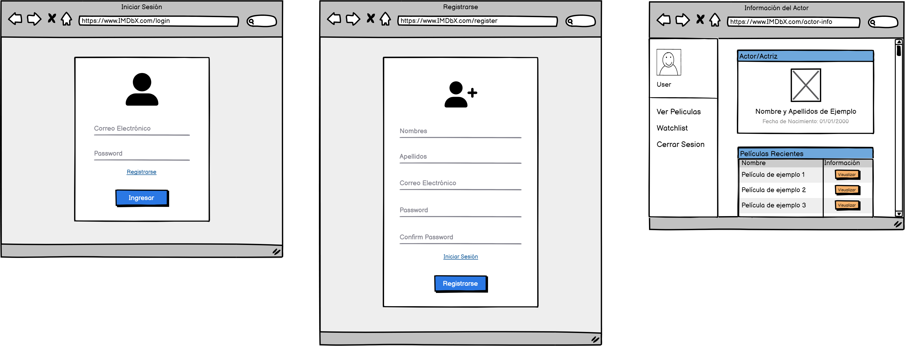
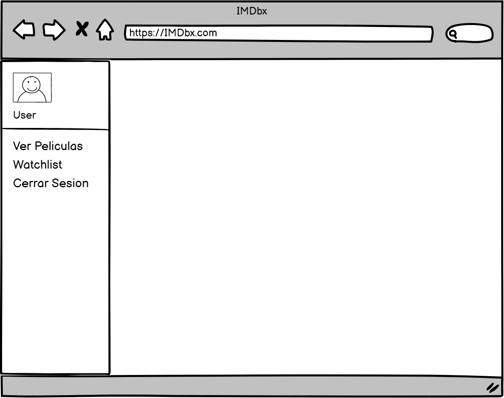
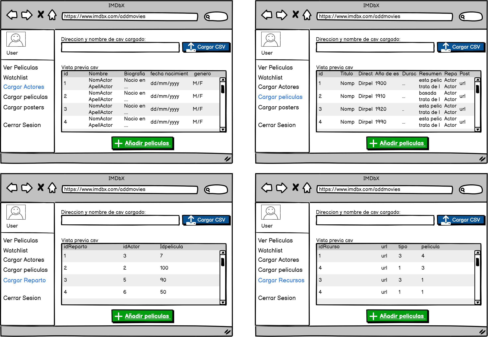
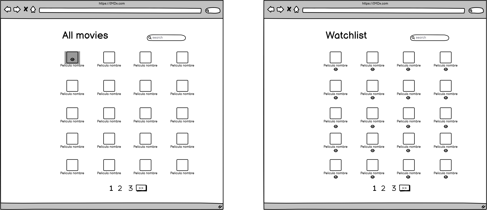
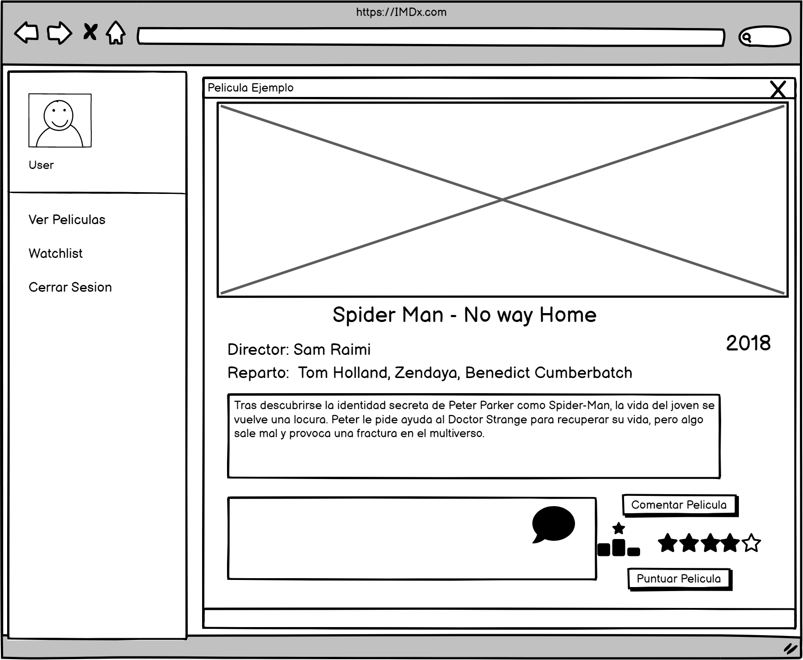
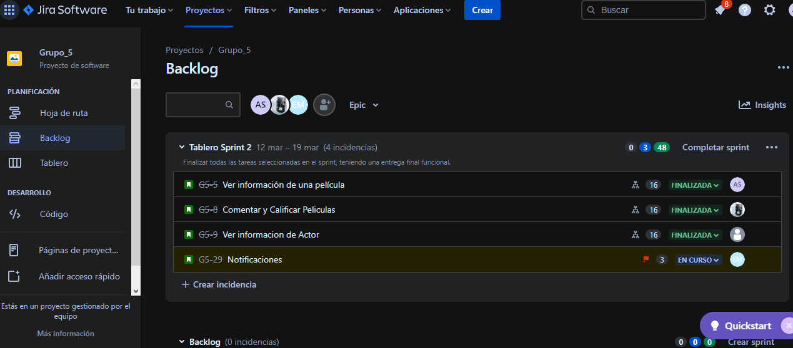

# AYD1_P2_G5

UNIVERSIDAD DE SAN CARLOS DE GUATEMALA

FACULTAD DE INGENIERIA

ESCUELA DE CIENCIAS Y SISTEMAS

ANALISIS Y DISEÑO DE SISTEMAS 1

PRIMER SEMESTRE 2023

---

---

---

---

---

---

---

 <h1>PRACTICA #2</h1> 

<!-- 
 <h1>CALCULADORA</h1> 
 -->

---

---

---

---

| Nombre   |      Carnet      |  
|----------|:-------------:|
| Edin Emanuel Montenegro Vasquez | 201709311 |
| Wilson Kevin Javier Chávez Cabrera| 201807428 |
| Angel Marcos David Lopez Chacon| 201807299 |
| Jorge Mario Castañeda Cragua | 201809938 |
| Alvaro Emmanuel Socop Pérez | 202000194 | 

---

---

---

---

---

---

---

---

---

# MANUAL TECNICO

>“Programa Orquestado en Docker-compose.”
## ÍNDICE
| Topico | Link |
| ------ | ------ |
| Introducción | [Ir](#intro) |
| Objetivos y alcances del sistema| [Ir](#ob) |
| Componentes utilizados | [Ir](#sis) |
| Sistema Operativo | [Ir](#sis) |
| Tecnologías utilizadas | [Ir](#tech) |
| Interfaz del programa | [Ir](#inter) |
| Conclusiones | [Ir](#Conclu) |

## Objetivos

Generales

- Aprender a utilizar la metodología ágil para el desarrollo de un proyecto.
- Mejorar el trabajo en equipo para obtener entregables de mayor calidad.
- Que el estudiante obtenga un acercamiento con herramientas para la gestión de proyectos.

Especificos

Ganar agilidad para desarrollar productos con un valor agregado creciente para los
clientes. A través de la metodología Scrum.
- Que el estudiante se familiarice con los roles integrados en la metodología Scrum.
- Utilizar una herramienta para la creación de prototipos visuales para la aplicación a desarrollar.

## MOCKUPS

## CAPTURA DEL TABLERO:
### TABLERO SPRINT 2

### BACKLOG

## ANEXOS
Tablero Jira

https://jorgem1610.atlassian.net/jira/software/projects/G5/boards/1

Mockups:

https://balsamiq.cloud/s3cdoqs/p9v7fmt/r2278

